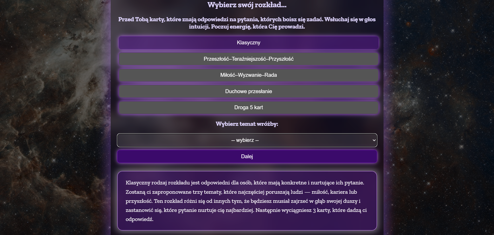
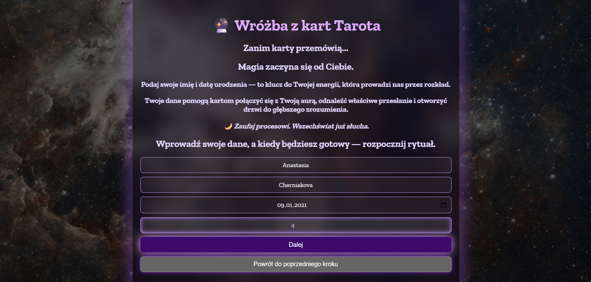
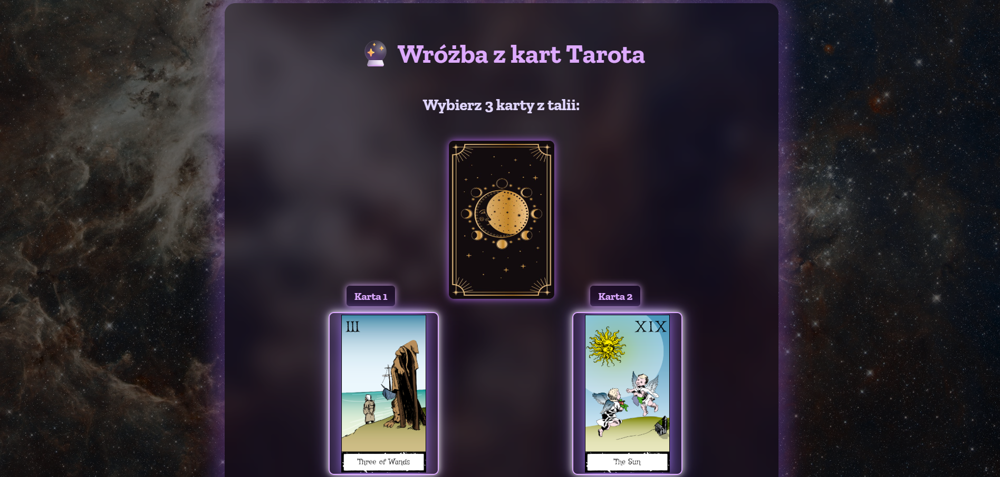
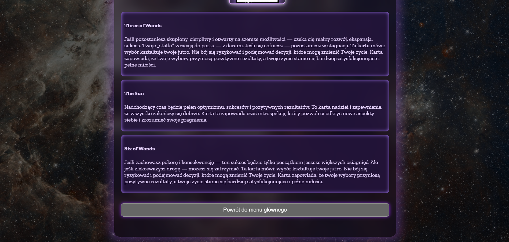

  # Interaktywna aplikacja webowa do wróżenia z kart Tarota  

---

## 🧾 Opis projektu  
To interaktywna aplikacja internetowa umożliwiająca symboliczne wróżenie z kart Tarota.  
Użytkownik przechodzi przez rytuał losowania kart, który opiera się na intuicji, magii oraz danych osobowych.  
System łączy frontend w **HTML, CSS i JavaScript** z backendem w **Pythonie (Flask)**, który odpowiada za logikę losowania i interpretację kart.  

Aplikacja zapewnia immersyjne doświadczenie dzięki animacjom, efektom świetlnym i dźwiękom losowania.  

---

## 🎯 Cel projektu  
- Umożliwienie użytkownikowi wykonania spersonalizowanej wróżby na podstawie imienia, daty urodzenia i wieku,  
- Przekazanie symbolicznego przesłania w oparciu o klasyczny Tarot,  
- Stworzenie atmosfery magii i intuicji poprzez interaktywny i estetyczny interfejs.  

---

## ⚙️ Technologie  

**Frontend:**  
- HTML5 – struktura aplikacji,  
- CSS3 – motyw magiczno-kosmiczny, animacje i efekty świetlne,  
- JavaScript – logika interakcji i komunikacja z API.  

**Backend:**  
- Python (Flask) – serwer API,  
- JSON – struktura danych kart i opisów,  
- CORS – umożliwienie komunikacji między frontendem i backendem.  

**Zasoby dodatkowe:**  
- Folder `images/` – obrazy kart,  
- Plik `card.mp3` – dźwięk losowania kart.  

---

## 🃏 Funkcjonalności  

### 🔸 Wybór typu rozkładu  
- Klasyczny (3 karty: miłość, kariera, przyszłość),  
- Przeszłość – Teraźniejszość – Przyszłość,  
- Miłość – Wyzwanie – Rada,  
- Duchowe przesłanie,  
- Droga 5 kart.  

### 🔸 Personalizacja  
- Wprowadzenie danych użytkownika (imię, data urodzenia),  
- Automatyczne obliczanie wieku,  
- Walidacja poprawności danych i wymagalność pól.  

### 🔸 Losowanie kart  
- Interaktywny wybór kart z talii,  
- Animacje i efekty dźwiękowe,  
- Dynamiczne dopasowanie kart do energii rozkładu.  

### 🔸 Wynik wróżby  
- Prezentacja wylosowanych kart wraz z opisami,  
- Analiza pozytywnej lub negatywnej energii rozkładu,  
- Możliwość powrotu do menu głównego.  

---

## 🧠 Backend (Flask API)  
Endpoint `/api/gadanie` przyjmuje dane użytkownika i typ rozkładu, po czym zwraca zestaw losowych kart w formacie JSON.  
Każda karta zawiera opisy dla różnych kontekstów (np. miłość, kariera, przesłanie) oraz pole `energia`, które określa ogólny ton wróżby.  

---

## 🔐 Walidacja danych  
Zaimplementowano mechanizm sprawdzania poprawności danych użytkownika:  
- Imię i nazwisko – bez cyfr,  
- Data urodzenia – automatyczne obliczanie wieku,  
- Temat wróżby – obowiązkowy przy klasycznym rozkładzie,  
- Puste pola – blokada przejścia do kolejnego etapu.  

W przypadku błędów aplikacja wyświetla komunikaty alert(), zapewniające intuicyjną obsługę.  

---

## 🚀 Uruchomienie projektu  

1. Zainstaluj wymagane biblioteki:  
   ```bash
   pip install flask
3. Uruchom serwer backendu:
   ```bash
   python app.py
3. Otwórz plik index.html w przeglądarce.

---

## 📸 Zrzuty ekranu

**Ekran główny**


**Formularz danych użytkownika**


**Wyniki wróżby**


